# Authentication & User Management System - Complete Analysis & Recommendations

## Executive Summary

This document provides a comprehensive analysis of the current authentication, access control, and user management systems in RNRL TradeHub, along with detailed recommendations for automation and integration with the Business Partner module.

---

## Table of Contents

1. [Current Implementation Analysis](#1-current-implementation-analysis)
2. [Business Requirements Analysis](#2-business-requirements-analysis)
3. [Proposed Automated User Onboarding Flow](#3-proposed-automated-user-onboarding-flow)
4. [Implementation Roadmap](#4-implementation-roadmap)
5. [Security & Compliance](#5-security--compliance)
6. [Technical Specifications](#6-technical-specifications)

---

## 1. Current Implementation Analysis

### 1.1 User Login Page (`src/pages/Login.tsx`)

#### Current Logic:
```typescript
// Login flow:
1. User enters email and password
2. System finds user by email from availableUsers array
3. Password validation: minimum 4 characters only
4. On success: calls onLogin(user) which stores user in localStorage
5. Demo login buttons for quick testing (Admin, Accounts, Sales, Vendor)
```

#### What's Working:
- ✅ Basic email/password form with validation
- ✅ Show/hide password toggle
- ✅ Remember me checkbox (UI only)
- ✅ Demo login shortcuts for testing
- ✅ Responsive design

#### What's Missing:
- ❌ **No real backend authentication** - currently uses mock data
- ❌ **No JWT/session tokens** - only stores user object in localStorage
- ❌ **No password hashing** - demo mode accepts any password
- ❌ **No session expiry** - user stays logged in indefinitely
- ❌ **No refresh token mechanism**
- ❌ **No forgot password flow**
- ❌ **No account lockout** after failed attempts
- ❌ **No MFA/2FA support**
- ❌ **No rate limiting**

#### Security Concerns:
1. **localStorage vulnerability**: User data in localStorage can be accessed by XSS attacks
2. **No token expiry**: Sessions never expire
3. **Weak password validation**: Only checks length >= 4
4. **No CSRF protection**
5. **No audit trail** of login attempts

---

### 1.2 Access Control System

#### What's Implemented:

**Role-Based Access Control (RBAC)** in `src/lib/permissions.ts`:

```typescript
Roles:
- Admin: Full access to all modules
- Sales: Limited to sales contracts, business partners, disputes
- Accounts: Financial modules (invoices, payments, commissions)
- Dispute Manager: Dispute resolution only
- Vendor/Client: Read-only access to their data

Modules:
13 modules including: Sales Contracts, Invoices, Payments, Disputes, 
Commissions, Vendors & Clients, User Management, Settings, Reports, 
Audit Trail, Roles & Rights, Grievance Officer, Business Partner

Permissions per module: create, read, update, delete, approve, share
```

**Roles & Rights Management** (`src/pages/RolesAndRights.tsx`):
- Matrix view of Role × Module × Permissions
- Admin-only access
- Edit mode to toggle permissions
- Changes saved (currently to mock state)

#### What's Missing:
- ❌ **No data isolation** - Vendor/Client users can potentially see all data
- ❌ **No row-level security** - Filters not applied at query level
- ❌ **No integration with Business Partner approval**
- ❌ **No automatic role assignment** based on user type
- ❌ **No permission inheritance** for sub-users
- ❌ **No temporary permissions** (time-limited access)
- ❌ **No delegation mechanism** (user A can delegate to user B)

---

### 1.3 User Management System

#### What's Implemented:

**User Management Page** (`src/pages/UserManagement.tsx`):
```typescript
User Types:
- back_office: Internal staff (Super Admin, Admin, Sales, Accounts, etc.)
- client: External buyers
- vendor: External suppliers

Features:
- ✅ CRUD operations via multiTenantApi
- ✅ Filter by user type and status
- ✅ Sub-user indicator badges
- ✅ Custom permissions per user
- ✅ Role assignment
- ✅ User status management (active, inactive, suspended)
```

**Sub-User Support** (`src/types/multiTenant.ts`):
```typescript
- Each client/vendor can add up to 2 sub-users (employees)
- Sub-users inherit parent's data access
- Custom permissions can be set per sub-user
- Activity tracking for sub-users
```

**API Integration** (`src/api/multiTenantApi.ts`):
```typescript
Endpoints available:
- POST /api/settings/auth/login
- GET /api/settings/users/me
- GET /api/settings/users (with filters)
- POST /api/settings/users
- PUT /api/settings/users/:id
- DELETE /api/settings/users/:id
- GET/POST/PUT/DELETE /api/settings/users/my-team (sub-users)
```

#### What's Missing:
- ❌ **No automatic user creation** when Business Partner is approved
- ❌ **No email-based provisioning**
- ❌ **No auto-generated passwords**
- ❌ **No "welcome email" with credentials**
- ❌ **No forced password change** on first login
- ❌ **No user invitation workflow**
- ❌ **No approval workflow** for back office users

---

### 1.4 Business Partner Module

#### Current Status:

**Vendors & Clients Page** (`src/pages/VendorsAndClients.tsx`):
```typescript
Business Partner Lifecycle:
1. DRAFT → Created by sales team
2. PENDING_COMPLIANCE → Awaiting KYC verification
3. ACTIVE → Approved and can transact
4. INACTIVE → Temporarily disabled
5. BLACKLISTED → Permanently blocked

Data captured:
- Legal name, contact details
- Business type (BUYER, SELLER, BOTH, AGENT)
- KYC documents (PAN, GST, Bank details)
- Registered address
- Multiple shipping addresses
```

#### The Big Gap:
**Business Partner approval does NOT create user accounts**

Currently:
1. Sales team creates Business Partner
2. Compliance approves KYC
3. Partner status → ACTIVE
4. **BUT**: No user account is created
5. **Manual step required**: Admin must separately go to User Management and create user

This creates:
- Manual overhead for admin
- Delay in onboarding
- Risk of forgetting to create user
- No automatic email to partner with login credentials

---

## 2. Business Requirements Analysis

### 2.1 User Types & Onboarding

Based on your requirements:

#### External Users (via Business Partner Module):
```
Business Partner Types → User Roles:
1. Buyer → Client Portal User
2. Seller (Vendor) → Vendor Portal User
3. Sub-Broker → Agent Portal User (with commission sharing)
4. Transporter → Logistics Portal User
5. Controller → Quality Control User
6. Trader → Trader Portal User
```

**Key Requirement**: When Business Partner is approved:
1. System should **automatically create primary user account**
2. Email should be from Business Partner contact email
3. System generates **temporary password**
4. Email sent to user with credentials
5. User must **change password on first login**
6. User can add **up to 2 additional office users** (employees)

#### Internal Users (Back Office):
```
Back Office Roles:
1. Super Admin → Full system access
2. Admin → User management + all modules
3. Sales Executive → Sales contracts, Business Partners
4. Finance Manager → Invoices, Payments, Commissions
5. Accountant → Read-only financial data
6. Compliance Officer → KYC verification
7. Dispute Manager → Dispute resolution
```

**Key Requirement**: Back office users created by:
1. Super Admin or Admin only
2. Role assigned during creation
3. Email-based invitation
4. Temporary password sent via email
5. Must change password on first login

---

### 2.2 The "2 Additional Users" Requirement

**Current Understanding**:
- Each Business Partner (owner/company) gets 1 primary user account
- They can add **2 more users** (their employees) to use the system
- Total: **3 users per Business Partner**

**How it should work**:

**Option A: During Business Partner Creation**
```
Business Partner Form:
├─ Company Details
├─ Primary Contact
│  ├─ Name
│  ├─ Email (becomes User ID)
│  └─ Phone
├─ Additional User 1 (Optional)
│  ├─ Name
│  ├─ Email (becomes User ID)
│  └─ Phone
└─ Additional User 2 (Optional)
   ├─ Name
   ├─ Email (becomes User ID)
   └─ Phone

On Approval:
→ System creates 1-3 user accounts (based on how many were provided)
→ Sends welcome email to each with temporary password
→ All 3 users see SAME data (company's data only)
```

**Option B: Primary User Adds Later** (Recommended)
```
Business Partner Form:
├─ Company Details
└─ Primary Contact
   ├─ Name
   ├─ Email (becomes User ID)
   └─ Phone

On Approval:
→ System creates PRIMARY user account only
→ Sends welcome email with temporary password

After Login:
→ Primary user goes to "My Team" in Settings
→ Can add up to 2 sub-users
→ Sub-users receive email invitation
→ Sub-users can have limited permissions (customizable by primary user)
```

**Recommendation**: **Option B** is better because:
1. Less complexity during onboarding
2. Primary user controls who gets access
3. Can add/remove employees as needed
4. Matches the existing sub-user architecture

---

### 2.3 Data Isolation Requirements

**Critical Security Requirement**: Users can only see their own data

#### For External Users (Clients/Vendors):
```sql
-- Example: Client viewing Sales Contracts
SELECT * FROM sales_contracts 
WHERE client_id = :current_user_client_id;

-- All queries must include this filter
```

**Implementation Strategy**:
```typescript
// Option 1: Query-level filtering (Backend)
app.get('/api/sales-contracts', authenticate, (req, res) => {
  const userId = req.user.id;
  const userType = req.user.userType;
  
  let query = 'SELECT * FROM sales_contracts';
  
  if (userType === 'client') {
    query += ` WHERE client_id = '${req.user.clientId}'`;
  } else if (userType === 'vendor') {
    query += ` WHERE vendor_id = '${req.user.vendorId}'`;
  }
  // back_office users see all
  
  // Execute query...
});

// Option 2: Row-Level Security (Database) - RECOMMENDED
CREATE POLICY sales_contracts_client_policy ON sales_contracts
  FOR SELECT
  USING (
    current_user_type() = 'back_office' OR
    (current_user_type() = 'client' AND client_id = current_user_client_id()) OR
    (current_user_type() = 'vendor' AND vendor_id = current_user_vendor_id())
  );
```

#### For Sub-Users:
Sub-users inherit parent's data access:
```typescript
if (user.isSubUser) {
  // Use parent user's clientId/vendorId for filtering
  const parentUser = await getUser(user.parentUserId);
  filterByClientId(parentUser.clientId);
}
```

---

## 3. Proposed Automated User Onboarding Flow

### 3.1 Business Partner → User Account (Automated)

```mermaid
graph TD
    A[Sales Creates Business Partner] --> B[Status: DRAFT]
    B --> C[Compliance Reviews KYC]
    C --> D{KYC Approved?}
    D -->|No| E[Status: REJECTED]
    D -->|Yes| F[Status: ACTIVE]
    F --> G[🔄 AUTO: Create Primary User Account]
    G --> H[🔄 AUTO: Generate Temporary Password]
    H --> I[🔄 AUTO: Send Welcome Email]
    I --> J[User Receives Credentials]
    J --> K[User Logs In First Time]
    K --> L[🔒 FORCED: Change Password]
    L --> M[User Can Access Portal]
    M --> N[User Can Add 2 Sub-Users Optional]
```



**Implementation Steps**:

**Step 1: Add User Creation Fields to Business Partner Form**
```typescript
// src/components/forms/BusinessPartnerForm.tsx

interface BusinessPartnerWithUser extends BusinessPartner {
  primaryUserEmail: string;  // Required
  primaryUserName: string;   // Required
  primaryUserPhone: string;  // Optional
}

// During Business Partner creation, capture primary user details
// These fields are separate from "contact_person" which is for business contact
```

**Step 2: Backend API - On Business Partner Approval**
```typescript
// Backend pseudo-code
async function approveBusinessPartner(partnerId: string) {
  // 1. Update partner status
  await db.businessPartners.update(partnerId, { status: 'ACTIVE' });
  
  // 2. Create primary user account
  const partner = await db.businessPartners.findById(partnerId);
  const temporaryPassword = generateSecurePassword(); // e.g., "Rnrl@1234Xyz"
  
  const newUser = await db.users.create({
    email: partner.primaryUserEmail,
    name: partner.primaryUserName,
    userType: partner.business_type === 'BUYER' ? 'client' : 'vendor',
    portal: partner.business_type === 'BUYER' ? 'client' : 'vendor',
    clientId: partner.business_type === 'BUYER' ? partner.id : null,
    vendorId: partner.business_type === 'SELLER' ? partner.id : null,
    status: 'active',
    isVerified: false,
    isSubUser: false,
    passwordHash: hashPassword(temporaryPassword),
    mustChangePassword: true, // Flag for forced password change
  });
  
  // 3. Send welcome email
  await sendWelcomeEmail({
    to: newUser.email,
    userName: newUser.name,
    temporaryPassword: temporaryPassword,
    loginUrl: 'https://tradehub.rnrl.com/login',
    companyName: partner.legal_name,
  });
  
  // 4. Log the action
  await auditLog({
    action: 'USER_AUTO_CREATED',
    userId: 'SYSTEM',
    details: `Auto-created user account for Business Partner ${partner.legal_name}`,
    partnerId: partner.id,
    newUserId: newUser.id,
  });
  
  return newUser;
}
```

**Step 3: Welcome Email Template**
```html
Subject: Welcome to RNRL TradeHub - Your Account is Ready

Dear {{userName}},

Your company {{companyName}} has been successfully onboarded to RNRL TradeHub.

Your login credentials:
━━━━━━━━━━━━━━━━━━━━
Email (User ID): {{email}}
Temporary Password: {{temporaryPassword}}
Login URL: {{loginUrl}}
━━━━━━━━━━━━━━━━━━━━

IMPORTANT SECURITY NOTICE:
⚠️ You MUST change your password on first login
⚠️ Do not share this password with anyone
⚠️ This temporary password will expire in 24 hours

Getting Started:
1. Click the login link above
2. Enter your email and temporary password
3. You'll be prompted to create a new secure password
4. Once logged in, you can add up to 2 additional users from your team

Need Help?
Contact our support team at support@rnrl.com

Best regards,
RNRL TradeHub Team
```

---

### 3.2 Primary User Adds Sub-Users (Self-Service)

```mermaid
graph TD
    A[Primary User Logs In] --> B[Goes to Settings → My Team]
    B --> C{Sub-users < 2?}
    C -->|No| D[Show: Limit Reached]
    C -->|Yes| E[Click Add Team Member]
    E --> F[Enter Name & Email]
    F --> G[🔄 AUTO: Create Sub-User]
    G --> H[🔄 AUTO: Generate Password]
    H --> I[🔄 AUTO: Send Invitation Email]
    I --> J[Sub-user Receives Email]
    J --> K[Sub-user Logs In]
    K --> L[🔒 FORCED: Change Password]
    L --> M[Sub-user Has Same Data Access as Primary]
```



**Implementation**:

**Frontend: My Team Page**
```typescript
// Already implemented in multiTenantApi.ts
// Just needs UI enhancement

// src/pages/Settings.tsx - Add "My Team" tab for client/vendor users

const MyTeamTab = () => {
  const [subUsers, setSubUsers] = useState<SubUser[]>([]);
  const [limits, setLimits] = useState<SubUserLimits>({ max: 2, current: 0, hasReachedLimit: false });
  
  useEffect(() => {
    loadMyTeam();
  }, []);
  
  const loadMyTeam = async () => {
    const data = await multiTenantApi.getMyTeam();
    setSubUsers(data.subUsers);
    setLimits(data.limits);
  };
  
  const handleAddSubUser = async (name: string, email: string) => {
    if (limits.hasReachedLimit) {
      alert('You have reached the maximum limit of 2 team members');
      return;
    }
    
    await multiTenantApi.addSubUser({ name, email, permissions: {} });
    await loadMyTeam();
  };
  
  // UI renders list + "Add Team Member" button if limit not reached
};
```

**Backend: Sub-User Creation**
```typescript
async function createSubUser(parentUserId: string, subUserData: SubUserInvitation) {
  // 1. Check limit
  const existingSubUsers = await db.users.count({ parentUserId });
  if (existingSubUsers >= 2) {
    throw new Error('Maximum 2 sub-users allowed');
  }
  
  // 2. Get parent user's affiliation
  const parentUser = await db.users.findById(parentUserId);
  
  // 3. Create sub-user
  const temporaryPassword = generateSecurePassword();
  const subUser = await db.users.create({
    email: subUserData.email,
    name: subUserData.name,
    userType: parentUser.userType, // Inherit from parent
    portal: parentUser.portal,
    clientId: parentUser.clientId, // Inherit data access
    vendorId: parentUser.vendorId,
    status: 'active',
    isSubUser: true,
    parentUserId: parentUser.id,
    subUserPermissions: subUserData.permissions || {},
    passwordHash: hashPassword(temporaryPassword),
    mustChangePassword: true,
  });
  
  // 4. Send invitation email
  await sendSubUserInvitationEmail({
    to: subUser.email,
    userName: subUser.name,
    parentUserName: parentUser.name,
    temporaryPassword: temporaryPassword,
  });
  
  return subUser;
}
```

---

### 3.3 Back Office User Creation (Admin Only)

```mermaid
graph TD
    A[Admin Goes to User Management] --> B[Click Add User]
    B --> C[Select: Back Office User Type]
    C --> D[Fill: Name, Email, Role]
    D --> E[Click Save]
    E --> F[🔄 System Creates User]
    F --> G[🔄 System Generates Password]
    G --> H[🔄 System Sends Email]
    H --> I[New User Receives Email]
    I --> J[User Logs In]
    J --> K[🔒 FORCED: Change Password]
    K --> L[User Access Based on Role]
```



**Implementation**: Already mostly done, just needs password generation + email

```typescript
// src/pages/UserManagement.tsx - handleSave function

const handleSave = async (data: User) => {
  if (modalMode === 'add' && data.userType === 'back_office') {
    // Backend will generate password and send email
    await multiTenantApi.createUser({
      ...data,
      mustChangePassword: true,
      // Backend generates password and sends email
    });
  }
};

// Backend:
async function createBackOfficeUser(userData) {
  const temporaryPassword = generateSecurePassword();
  
  const newUser = await db.users.create({
    ...userData,
    passwordHash: hashPassword(temporaryPassword),
    mustChangePassword: true,
    isVerified: false,
  });
  
  await sendBackOfficeWelcomeEmail({
    to: newUser.email,
    userName: newUser.name,
    role: newUser.role,
    temporaryPassword: temporaryPassword,
  });
  
  return newUser;
}
```

---

## 4. Implementation Roadmap

### Phase 1: Authentication Enhancement (Week 1-2)

**Priority: HIGH - Security Critical**

#### Tasks:
- [ ] **JWT Token Management**
  ```typescript
  // Update src/api/client.ts
  - Store JWT in httpOnly cookie (backend) or secure localStorage
  - Add Authorization header to all requests
  - Implement token refresh mechanism
  - Handle 401 responses (redirect to login)
  ```

- [ ] **Secure Login Flow**
  ```typescript
  // Update src/pages/Login.tsx
  - Call multiTenantApi.login(email, password)
  - Receive { user, token } from backend
  - Store token using apiClient.setToken(token)
  - Redirect to appropriate portal based on user.userType
  ```

- [ ] **Session Management**
  ```typescript
  // New: src/hooks/useSession.ts
  - Track session expiry (JWT exp claim)
  - Auto-refresh token before expiry
  - Auto-logout on expiry
  - Handle concurrent sessions
  ```

- [ ] **Password Requirements**
  ```typescript
  // New: src/utils/passwordValidation.ts
  - Minimum 8 characters
  - Must include: uppercase, lowercase, number, special char
  - Cannot be common password
  - Cannot be same as email
  ```

- [ ] **Forced Password Change**
  ```typescript
  // New: src/pages/ChangePassword.tsx
  - Check user.mustChangePassword flag
  - Show change password modal before showing main app
  - Validate new password strength
  - Update backend and clear flag
  ```

**Deliverables**:
- Secure JWT-based authentication
- Session timeout handling
- Forced password change on first login
- Password strength validation

---

### Phase 2: Business Partner Integration (Week 3-4)

**Priority: HIGH - Automation Critical**

#### Tasks:
- [ ] **Update Business Partner Form**
  ```typescript
  // Update src/components/forms/BusinessPartnerForm.tsx
  
  // Add new section: Primary User Details
  <FormSection title="Primary User Account">
    <FormInput 
      label="Primary Contact Name" 
      value={primaryUserName}
      required 
    />
    <FormInput 
      label="Primary Contact Email (Will be User ID)" 
      type="email"
      value={primaryUserEmail}
      required
      helpText="This email will receive login credentials"
    />
    <FormInput 
      label="Primary Contact Phone" 
      value={primaryUserPhone}
    />
  </FormSection>
  ```

- [ ] **Backend API: Auto User Creation**
  ```typescript
  // Backend endpoint
  POST /api/business-partners/:id/approve
  
  Response includes:
  {
    partner: BusinessPartner,
    userCreated: true,
    userId: "user_123",
    emailSent: true
  }
  ```

- [ ] **Email Service Integration**
  ```typescript
  // New: src/services/emailService.ts (Backend)
  - sendWelcomeEmail(user, temporaryPassword)
  - sendSubUserInvitation(subUser, temporaryPassword, parentUser)
  - sendPasswordReset(user, resetToken)
  - sendAccountActivation(user)
  ```

- [ ] **Audit Logging**
  ```typescript
  // Track all user creation events
  {
    action: 'USER_AUTO_CREATED',
    triggeredBy: 'BUSINESS_PARTNER_APPROVAL',
    partnerId: 'bp_123',
    userId: 'user_456',
    timestamp: '2025-11-12T10:00:00Z'
  }
  ```

**Deliverables**:
- Automatic user creation on BP approval
- Email notifications with credentials
- Audit trail of all user creation events

---

### Phase 3: Data Isolation (Week 5-6)

**Priority: CRITICAL - Security & Compliance**

#### Tasks:
- [ ] **Backend Query Filtering**
  ```typescript
  // Middleware: src/middleware/dataFilter.ts (Backend)
  
  export function applyDataIsolation(req, res, next) {
    const user = req.user;
    
    // Attach data filter to request
    req.dataFilter = {};
    
    if (user.userType === 'client') {
      req.dataFilter.clientId = user.clientId;
    } else if (user.userType === 'vendor') {
      req.dataFilter.vendorId = user.vendorId;
    }
    // back_office has no filter (sees all data)
    
    next();
  }
  
  // Apply to all data endpoints
  app.use('/api/sales-contracts', applyDataIsolation);
  app.use('/api/invoices', applyDataIsolation);
  // etc.
  ```

- [ ] **Row-Level Security (Database)**
  ```sql
  -- PostgreSQL example
  
  -- Function to get current user's type
  CREATE FUNCTION current_user_type() RETURNS TEXT AS $$
    SELECT current_setting('app.user_type', true);
  $$ LANGUAGE SQL STABLE;
  
  -- Function to get current user's client ID
  CREATE FUNCTION current_user_client_id() RETURNS TEXT AS $$
    SELECT current_setting('app.client_id', true);
  $$ LANGUAGE SQL STABLE;
  
  -- Policy for sales_contracts
  CREATE POLICY sales_contracts_isolation ON sales_contracts
    FOR ALL
    USING (
      current_user_type() = 'back_office' OR
      (current_user_type() = 'client' AND client_id = current_user_client_id()) OR
      (current_user_type() = 'vendor' AND vendor_id = current_user_vendor_id())
    );
  
  -- Enable RLS
  ALTER TABLE sales_contracts ENABLE ROW LEVEL SECURITY;
  
  -- Set session variables on each request
  -- Backend sets: SET app.user_type = 'client'; SET app.client_id = 'client_123';
  ```

- [ ] **Frontend Data Access Helpers**
  ```typescript
  // src/lib/dataAccess.ts
  
  export function canUserAccessContract(user: User, contract: SalesContract): boolean {
    if (user.userType === 'back_office') return true;
    
    if (user.userType === 'client') {
      return contract.clientId === user.clientId;
    }
    
    if (user.userType === 'vendor') {
      return contract.vendorId === user.vendorId;
    }
    
    return false;
  }
  
  // Use in components to hide/show data
  ```

- [ ] **Sub-User Inheritance**
  ```typescript
  // Sub-users automatically inherit parent's data access
  
  if (user.isSubUser) {
    const parentUser = await getUser(user.parentUserId);
    user.clientId = parentUser.clientId;
    user.vendorId = parentUser.vendorId;
  }
  
  // Then apply same filters as parent
  ```

**Deliverables**:
- Complete data isolation for external users
- Sub-users inherit parent's data access
- Backend enforces filters (not just frontend)
- Database-level security (RLS)

---

### Phase 4: My Team Management (Week 7)

**Priority: MEDIUM - User Convenience**

#### Tasks:
- [ ] **My Team UI**
  ```typescript
  // New component: src/components/settings/MyTeam.tsx
  
  - Show current sub-users (max 2)
  - "Add Team Member" button (disabled if limit reached)
  - Edit sub-user permissions
  - Deactivate/Reactivate sub-users
  - View sub-user activity log
  ```

- [ ] **Sub-User Permissions**
  ```typescript
  // Granular permissions for sub-users
  
  interface SubUserPermissions {
    canViewContracts: boolean;
    canViewInvoices: boolean;
    canViewPayments: boolean;
    canDownloadDocuments: boolean;
    canRaiseDisputes: boolean;
    canCommunicateWithSupport: boolean;
  }
  
  // Primary user can customize for each sub-user
  ```

- [ ] **Invitation & Acceptance Flow**
  ```typescript
  // Option 1: Auto-create with temp password (current approach)
  - Primary user enters sub-user email
  - System creates account + sends email
  - Sub-user logs in and changes password
  
  // Option 2: Invitation-based (more secure)
  - Primary user sends invitation
  - Sub-user receives email with invitation link
  - Sub-user clicks link, sets their own password
  - Account activated
  ```

**Deliverables**:
- Self-service sub-user management
- Customizable permissions per sub-user
- Activity tracking for compliance

---

### Phase 5: Enhanced Security (Week 8)

**Priority: HIGH - Compliance**

#### Tasks:
- [ ] **Account Lockout**
  ```typescript
  // After 5 failed login attempts in 15 minutes
  - Lock account for 30 minutes
  - Send email notification to user
  - Admin can manually unlock
  ```

- [ ] **Password Policy**
  ```typescript
  - Enforce password complexity
  - Password expiry (90 days)
  - Cannot reuse last 5 passwords
  - Prompt to change before expiry
  ```

- [ ] **Session Security**
  ```typescript
  - Max 2 concurrent sessions per user
  - Show active sessions in settings
  - User can revoke sessions
  - Auto-logout inactive sessions (30 min)
  ```

- [ ] **Audit & Compliance**
  ```typescript
  // Log everything:
  - Login attempts (success/failure)
  - Password changes
  - Permission changes
  - Data access (who viewed what)
  - Sub-user creation/deletion
  - Session creation/termination
  ```

- [ ] **2FA (Optional - Future)**
  ```typescript
  - Email OTP
  - SMS OTP
  - Authenticator app (TOTP)
  - Backup codes
  ```

**Deliverables**:
- Enterprise-grade security
- Compliance-ready audit trail
- Protection against common attacks

---

## 5. Security & Compliance

### 5.1 Security Checklist

#### Authentication Security:
- [x] **HTTPS only** - Already using SSL
- [ ] **Password hashing** - bcrypt with salt (Backend)
- [ ] **JWT tokens** - Signed with secret key
- [ ] **Token expiry** - 1 hour access token, 7 day refresh token
- [ ] **httpOnly cookies** - Prevent XSS attacks
- [ ] **CSRF tokens** - For state-changing operations
- [ ] **Rate limiting** - Max 5 login attempts per 15 min
- [ ] **Account lockout** - After 5 failed attempts

#### Authorization Security:
- [ ] **Role-based access control (RBAC)** - Already implemented
- [ ] **Attribute-based access control (ABAC)** - For fine-grained control
- [ ] **Data isolation** - Row-level security
- [ ] **Permission validation** - Both frontend and backend
- [ ] **Least privilege** - Users get minimum necessary permissions

#### Data Security:
- [ ] **Encryption at rest** - Database encryption (Backend/Infrastructure)
- [ ] **Encryption in transit** - TLS 1.3
- [ ] **Input validation** - Prevent SQL injection, XSS
- [ ] **Output encoding** - Prevent XSS
- [ ] **Parameterized queries** - Prevent SQL injection
- [ ] **File upload validation** - Type, size, content scanning

#### Session Security:
- [ ] **Secure session storage** - httpOnly cookies
- [ ] **Session timeout** - 30 min inactivity, 8 hr absolute
- [ ] **Concurrent session limits** - Max 2 per user
- [ ] **Session revocation** - Logout all sessions
- [ ] **Remember me** - Separate long-lived token

---

### 5.2 Compliance Requirements

#### GDPR (if applicable):
- [ ] **Right to access** - Users can download their data
- [ ] **Right to erasure** - Users can request account deletion
- [ ] **Data portability** - Export in standard format (JSON/CSV)
- [ ] **Consent management** - Track consent for data processing
- [ ] **Audit trail** - Who accessed what data when

#### SOC 2 (if applicable):
- [ ] **Access controls** - Who can access what
- [ ] **Change management** - Log all permission changes
- [ ] **Monitoring** - Track suspicious activity
- [ ] **Incident response** - Process for security incidents
- [ ] **Audit logging** - Comprehensive logs

#### Industry Best Practices:
- [ ] **Password policy** - Complexity, expiry, history
- [ ] **MFA** - For sensitive operations
- [ ] **Principle of least privilege**
- [ ] **Separation of duties** - No single user has too much power
- [ ] **Regular security reviews**

---

## 6. Technical Specifications

### 6.1 Database Schema Updates

#### Users Table Enhancement:
```sql
ALTER TABLE users ADD COLUMN must_change_password BOOLEAN DEFAULT FALSE;
ALTER TABLE users ADD COLUMN password_changed_at TIMESTAMP;
ALTER TABLE users ADD COLUMN password_expires_at TIMESTAMP;
ALTER TABLE users ADD COLUMN failed_login_attempts INTEGER DEFAULT 0;
ALTER TABLE users ADD COLUMN locked_until TIMESTAMP;
ALTER TABLE users ADD COLUMN last_login_at TIMESTAMP;
ALTER TABLE users ADD COLUMN last_login_ip VARCHAR(45);
ALTER TABLE users ADD COLUMN sessions_count INTEGER DEFAULT 0;

CREATE INDEX idx_users_must_change_password ON users(must_change_password);
CREATE INDEX idx_users_locked_until ON users(locked_until);
```

#### Sessions Table (New):
```sql
CREATE TABLE user_sessions (
  id UUID PRIMARY KEY DEFAULT gen_random_uuid(),
  user_id UUID NOT NULL REFERENCES users(id) ON DELETE CASCADE,
  token_hash VARCHAR(255) NOT NULL,
  refresh_token_hash VARCHAR(255),
  ip_address VARCHAR(45),
  user_agent TEXT,
  created_at TIMESTAMP NOT NULL DEFAULT NOW(),
  expires_at TIMESTAMP NOT NULL,
  last_activity TIMESTAMP NOT NULL DEFAULT NOW(),
  is_active BOOLEAN DEFAULT TRUE,
  
  CONSTRAINT fk_user FOREIGN KEY (user_id) REFERENCES users(id)
);

CREATE INDEX idx_sessions_user_id ON user_sessions(user_id);
CREATE INDEX idx_sessions_token_hash ON user_sessions(token_hash);
CREATE INDEX idx_sessions_expires_at ON user_sessions(expires_at);
```

#### Audit Log Table Enhancement:
```sql
ALTER TABLE audit_logs ADD COLUMN user_id UUID REFERENCES users(id);
ALTER TABLE audit_logs ADD COLUMN ip_address VARCHAR(45);
ALTER TABLE audit_logs ADD COLUMN user_agent TEXT;
ALTER TABLE audit_logs ADD COLUMN resource_type VARCHAR(100);
ALTER TABLE audit_logs ADD COLUMN resource_id VARCHAR(255);
ALTER TABLE audit_logs ADD COLUMN changes JSONB;

CREATE INDEX idx_audit_logs_user_id ON audit_logs(user_id);
CREATE INDEX idx_audit_logs_resource ON audit_logs(resource_type, resource_id);
CREATE INDEX idx_audit_logs_timestamp ON audit_logs(timestamp DESC);
```

---

### 6.2 API Endpoints Specification

#### Authentication Endpoints:
```
POST /api/auth/login
Body: { email, password }
Response: { user, accessToken, refreshToken }

POST /api/auth/logout
Headers: Authorization: Bearer {token}
Response: { success: true }

POST /api/auth/refresh
Body: { refreshToken }
Response: { accessToken, refreshToken }

POST /api/auth/forgot-password
Body: { email }
Response: { message: "Reset link sent" }

POST /api/auth/reset-password
Body: { token, newPassword }
Response: { success: true }

POST /api/auth/change-password
Headers: Authorization: Bearer {token}
Body: { currentPassword, newPassword }
Response: { success: true }

GET /api/auth/sessions
Headers: Authorization: Bearer {token}
Response: { sessions: [...] }

DELETE /api/auth/sessions/:sessionId
Headers: Authorization: Bearer {token}
Response: { success: true }
```

#### User Management Endpoints:
```
GET /api/users/me
Headers: Authorization: Bearer {token}
Response: { user, permissions, dataFilters }

POST /api/users (Admin only)
Body: { name, email, userType, role, ... }
Response: { user, temporaryPassword, emailSent }

PUT /api/users/:id
Headers: Authorization: Bearer {token}
Body: { updates }
Response: { user }

DELETE /api/users/:id (Admin only)
Headers: Authorization: Bearer {token}
Response: { success: true }
```

#### Sub-User Management:
```
GET /api/users/my-team
Headers: Authorization: Bearer {token}
Response: { subUsers, limits: { max: 2, current: 1, hasReachedLimit: false } }

POST /api/users/my-team
Headers: Authorization: Bearer {token}
Body: { name, email, permissions }
Response: { subUser, temporaryPassword, emailSent }

PUT /api/users/my-team/:id
Headers: Authorization: Bearer {token}
Body: { permissions, isActive }
Response: { subUser }

DELETE /api/users/my-team/:id
Headers: Authorization: Bearer {token}
Response: { success: true }
```

#### Business Partner Integration:
```
POST /api/business-partners/:id/approve
Headers: Authorization: Bearer {token}
Response: { 
  partner, 
  userCreated: true, 
  userId: "...", 
  emailSent: true 
}
```

---

### 6.3 Frontend Components Specification

#### New Components to Create:

**1. ChangePasswordModal.tsx**
```typescript
interface ChangePasswordModalProps {
  isOpen: boolean;
  isMandatory: boolean; // If true, user can't close without changing
  onPasswordChanged: () => void;
}

// Shows when user.mustChangePassword is true
// Validates new password strength
// Updates backend and clears flag
```

**2. SessionManager.tsx**
```typescript
// Background component that:
- Monitors token expiry
- Refreshes token automatically
- Shows "Session expiring soon" warning
- Auto-logouts on expiry
- Handles concurrent session limits
```

**3. MyTeamSettings.tsx**
```typescript
// In Settings → My Team tab
// Shows:
- Current sub-users (0-2)
- Add team member button
- Sub-user permissions editor
- Deactivate/reactivate controls
- Activity log viewer
```

**4. SecuritySettings.tsx**
```typescript
// In Settings → Security tab
// Shows:
- Change password
- Active sessions
- Login history
- 2FA settings (future)
- Security notifications
```

---

### 6.4 Configuration Files

#### .env Variables:
```bash
# Authentication
VITE_JWT_SECRET=your-super-secret-jwt-key-here
VITE_JWT_ACCESS_EXPIRY=1h
VITE_JWT_REFRESH_EXPIRY=7d
VITE_SESSION_TIMEOUT=30m
VITE_MAX_CONCURRENT_SESSIONS=2

# Password Policy
VITE_PASSWORD_MIN_LENGTH=8
VITE_PASSWORD_REQUIRE_UPPERCASE=true
VITE_PASSWORD_REQUIRE_LOWERCASE=true
VITE_PASSWORD_REQUIRE_NUMBER=true
VITE_PASSWORD_REQUIRE_SPECIAL=true
VITE_PASSWORD_EXPIRY_DAYS=90
VITE_PASSWORD_HISTORY_COUNT=5

# Account Lockout
VITE_MAX_LOGIN_ATTEMPTS=5
VITE_LOCKOUT_DURATION_MINUTES=30

# Email Configuration
VITE_SMTP_HOST=smtp.gmail.com
VITE_SMTP_PORT=587
VITE_SMTP_USER=noreply@rnrl.com
VITE_SMTP_FROM_NAME=RNRL TradeHub
```

---

## 7. Testing Strategy

### 7.1 Unit Tests

```typescript
// src/utils/passwordValidation.test.ts
describe('Password Validation', () => {
  test('should reject password < 8 characters', () => {
    expect(validatePassword('Test@1')).toBe(false);
  });
  
  test('should reject password without uppercase', () => {
    expect(validatePassword('test@1234')).toBe(false);
  });
  
  test('should accept strong password', () => {
    expect(validatePassword('Test@1234')).toBe(true);
  });
});

// src/lib/dataAccess.test.ts
describe('Data Access Control', () => {
  test('back office user can access all contracts', () => {
    const user = { userType: 'back_office' };
    const contract = { clientId: 'any' };
    expect(canUserAccessContract(user, contract)).toBe(true);
  });
  
  test('client user can only access their contracts', () => {
    const user = { userType: 'client', clientId: 'client1' };
    const ownContract = { clientId: 'client1' };
    const otherContract = { clientId: 'client2' };
    
    expect(canUserAccessContract(user, ownContract)).toBe(true);
    expect(canUserAccessContract(user, otherContract)).toBe(false);
  });
});
```

### 7.2 Integration Tests

```typescript
// tests/integration/auth.test.ts
describe('Authentication Flow', () => {
  test('should login with valid credentials', async () => {
    const response = await api.post('/api/auth/login', {
      email: 'test@example.com',
      password: 'Test@1234'
    });
    
    expect(response.data.accessToken).toBeDefined();
    expect(response.data.user.email).toBe('test@example.com');
  });
  
  test('should reject invalid credentials', async () => {
    await expect(
      api.post('/api/auth/login', {
        email: 'test@example.com',
        password: 'wrong'
      })
    ).rejects.toThrow();
  });
  
  test('should force password change on first login', async () => {
    // Login with temp password
    const loginResponse = await api.post('/api/auth/login', {
      email: 'newuser@example.com',
      password: 'TempPass@123'
    });
    
    expect(loginResponse.data.user.mustChangePassword).toBe(true);
    
    // Try to access data without changing password
    await expect(
      api.get('/api/sales-contracts', {
        headers: { Authorization: `Bearer ${loginResponse.data.accessToken}` }
      })
    ).rejects.toThrow('Password change required');
  });
});
```

### 7.3 E2E Tests

```typescript
// tests/e2e/businessPartner.test.ts
describe('Business Partner to User Onboarding', () => {
  test('should auto-create user when BP is approved', async () => {
    // 1. Create Business Partner
    const bp = await createBusinessPartner({
      legal_name: 'Test Company',
      primaryUserEmail: 'contact@testcompany.com',
      primaryUserName: 'John Doe',
      business_type: 'BUYER'
    });
    
    // 2. Approve Business Partner
    await approveBusinessPartner(bp.id);
    
    // 3. Verify user was created
    const user = await findUserByEmail('contact@testcompany.com');
    expect(user).toBeDefined();
    expect(user.userType).toBe('client');
    expect(user.clientId).toBe(bp.id);
    expect(user.mustChangePassword).toBe(true);
    
    // 4. Verify email was sent
    const sentEmails = await getTestEmails();
    expect(sentEmails).toContainEqual(
      expect.objectContaining({
        to: 'contact@testcompany.com',
        subject: expect.stringContaining('Welcome to RNRL TradeHub')
      })
    );
  });
});
```

---

## 8. Migration Plan

### Step 1: Backup Current State
```bash
# Backup database
pg_dump rnrl_tradehub > backup_pre_migration.sql

# Backup code
git tag v1.0-pre-auth-enhancement
git push origin v1.0-pre-auth-enhancement
```

### Step 2: Database Migrations
```sql
-- Run in order:
-- 001_add_user_security_fields.sql
-- 002_create_sessions_table.sql
-- 003_enhance_audit_logs.sql
-- 004_add_data_isolation_policies.sql
```

### Step 3: Deploy Backend Changes
```bash
# Deploy to staging first
npm run deploy:staging

# Test all endpoints
npm run test:integration

# Deploy to production
npm run deploy:production
```

### Step 4: Deploy Frontend Changes
```bash
# Build production bundle
npm run build

# Deploy to CDN/hosting
npm run deploy

# Monitor for errors
```

### Step 5: Data Migration
```typescript
// Migrate existing users
- Add mustChangePassword = true for all existing users
- Send email to all users about password change requirement
- Create sessions for currently logged-in users
- Generate temporary passwords for users without passwords
```

---

## 9. Monitoring & Alerts

### Metrics to Track:
- Login success/failure rate
- Password change completion rate
- Session duration distribution
- Concurrent sessions per user
- Failed login attempts (potential attacks)
- API endpoint response times
- Database query performance

### Alerts to Set Up:
- Spike in failed logins (> 10 in 1 min) → Potential attack
- User locked out → Security team notification
- Session creation failure → System health issue
- Email send failure → Integration issue
- Database query timeout → Performance issue

---

## 10. Next Steps & Recommendations

### Immediate Priorities (Do First):
1. **Phase 1: Authentication Enhancement** - Critical security fix
2. **Phase 2: Business Partner Integration** - Automates manual work
3. **Phase 3: Data Isolation** - Critical compliance requirement

### Medium Term (Next Quarter):
4. **Phase 4: My Team Management** - User convenience
5. **Phase 5: Enhanced Security** - Additional hardening

### Long Term (Future):
6. SSO integration (if needed for enterprise customers)
7. Mobile app authentication
8. Biometric authentication
9. Advanced threat detection
10. Compliance certifications (SOC 2, ISO 27001)

---

## Conclusion

**Current State**: 
- Basic authentication exists but lacks security
- Access control is role-based but not enforced
- User management exists but is manual
- No integration between Business Partner and User creation

**Target State**:
- Secure JWT-based authentication
- Forced password changes
- Automatic user creation on BP approval
- Complete data isolation
- Self-service sub-user management
- Enterprise-grade security
- Full audit trail

**Estimated Effort**: 8 weeks (2 developers)

**ROI**: 
- 85% reduction in manual user onboarding work
- Zero risk of data leakage between customers
- Compliance-ready from day one
- Better user experience

---

## Questions for Discussion

1. **Password Policy**: Should we enforce 90-day password expiry or make it configurable?

2. **Sub-User Limit**: Is 2 sub-users sufficient, or should we make it configurable per customer?

3. **Email Provider**: Which email service should we use (SendGrid, AWS SES, Gmail SMTP)?

4. **Session Timeout**: 30 minutes inactivity vs 8 hours absolute - is this acceptable?

5. **MFA**: Should we plan for MFA in Phase 1 or defer to Phase 5?

6. **Business Partner Fields**: Should we capture sub-user emails during BP creation or let primary user add them later?

7. **Approval Workflow**: Should back office user creation require approval from Super Admin?

---

**Document Version**: 1.0  
**Last Updated**: November 12, 2025  
**Author**: GitHub Copilot Agent  
**Status**: Awaiting Review & Approval
